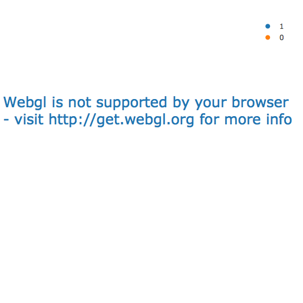

    
## Introduction
1. Plotly is an online analytics and data visualization tool, that host variaty APIs like R, python, JS etc. R API is entirely open source, free, and self-hosted. 
2. R user can access plotly with plotly package, which can be installed from CRAN. Function plot_ly can be called directory. Graphs using ggplot can be convert to Plotly graph using Figure converter function plotly::ggplotly to enable dynamic effect.
3. The advantage of Plotly is the graph are not static anymore. They are more interactive, and thus can provide more information. D3 graphs can be enabled as well.
 
This APP is designed to explore the two functions plotly provide for R users: API and graph converter. 

---
    
## 2D plot
 
 
> 1. mtcars dataset is used. User can select which variable/variables they want to plot against, and select which variable to color them. 

> 2. Plots are made with ggplot2 package. And plotly is enabled with plotly figure converter - ggplotly.

> 3. Plotly R API made it more interactive as can show the coordinates and some statistical details. Put your cursor on the graph to explore.

---
    
## 3D plot
 
 
> 1. 3D plot is enabled with plot_ly function. Which made available through plotly R API. 

> 2. User can turn, zoom, and rotate the 3D graph to explore data in different angle. Coordinates can be shown when moving cursor on the graph.

---
    
## 3D plot continue...

